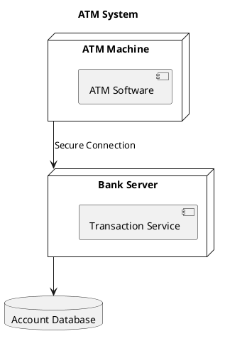
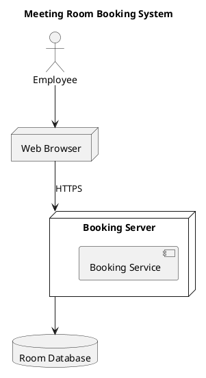
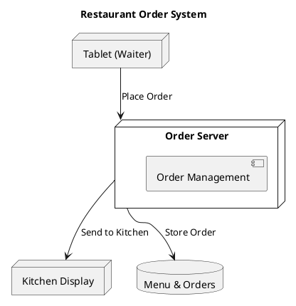

# 📋 Simple Deployment Diagrams - Templates

Template แบบง่ายๆ ที่สามารถนำไปปรับใช้กับระบบต่างๆ ได้

---

## 📂 Templates (6 แบบ)

### 1. **simple-01-basic-web.puml**
```
User → Browser → Web Server → Database
```
**ใช้กับ:** ระบบเว็บทั่วไป, Blog, CMS

---

### 2. **simple-02-client-server.puml**
```
Multiple Clients → Single Server
```
**ใช้กับ:** ระบบออฟฟิศ, ระบบภายในองค์กร, ระบบ POS

---

### 3. **simple-03-three-tier.puml**
```
Client → App Server → Database Server
```
**ใช้กับ:** Web Application, Enterprise System, E-Commerce

---

### 4. **simple-04-mobile-app.puml**
```
Mobile App → API Server → Database
```
**ใช้กับ:** Mobile Applications, REST API System

---

### 5. **simple-05-with-backup.puml**
```
Client → Server → Main DB
                   ↓
              Backup DB
```
**ใช้กับ:** ระบบที่ต้องการ backup, ระบบสำคัญ

---

### 6. **simple-06-load-balancer.puml**
```
User → Load Balancer → Server 1 → Shared DB
                     → Server 2 ↗
```
**ใช้กับ:** ระบบที่มี traffic สูง, ต้องการ High Availability

---

## 🔧 วิธีปรับใช้

### ขั้นตอนการปรับแต่ง:
1. เลือก template ที่ใกล้เคียงกับระบบของคุณ
2. เปลี่ยนชื่อ nodes ให้ตรงกับระบบจริง
3. เพิ่ม/ลด components ตามต้องการ
4. เพิ่ม notes อธิบายรายละเอียด

---

## 📝 ตัวอย่างการปรับแต่ง

### ตัวอย่างที่ 1: ระบบ ATM


### ตัวอย่างที่ 2: ระบบจองห้องประชุม


### ตัวอย่างที่ 3: ระบบร้านอาหาร


---

## 🎯 เลือก Template ตามความต้องการ

| ถ้าระบบของคุณ... | ใช้ Template |
|-------------------|--------------|
| เป็นเว็บไซต์ธรรมดา | `simple-01-basic-web.puml` |
| มีหลาย clients ใช้ server เดียวกัน | `simple-02-client-server.puml` |
| แยก app logic และ database | `simple-03-three-tier.puml` |
| เป็น mobile app | `simple-04-mobile-app.puml` |
| ต้องการ backup data | `simple-05-with-backup.puml` |
| มี traffic สูง | `simple-06-load-balancer.puml` |

---

## ✏️ การเพิ่ม Components

### เพิ่ม Node
```plantuml
node "ชื่อ Node" as alias {
  [Component]
}
```

### เพิ่ม Database
```plantuml
database "ชื่อ DB" as db_alias
```

### เพิ่ม Connection
```plantuml
nodeA --> nodeB : label
```

### เพิ่ม Actor
```plantuml
actor "ชื่อผู้ใช้" as user_alias
```

### เพิ่ม Note
```plantuml
note right of node_name
  คำอธิบาย
end note
```

---

## 💡 Tips

1. **ตั้งชื่อให้ชัดเจน** - ใช้ชื่อที่สื่อความหมาย
2. **เริ่มจากง่าย** - ไม่ต้องซับซ้อนตั้งแต่แรก
3. **เพิ่มทีละน้อย** - ค่อยๆ เพิ่ม details
4. **ใส่ protocol** - เช่น HTTPS, JDBC, TCP/IP
5. **อย่าลืม backup** - ถ้าเป็นระบบสำคัญ

---

## 🔍 Quick Reference

### Nodes & Components
```plantuml
node "Server"           ' กล่อง 3D
[Component]             ' กล่องธรรมดา
database "DB"           ' ฐานข้อมูล
actor User              ' คน
cloud "Cloud"           ' cloud
```

### Connections
```plantuml
A --> B                 ' ธรรมดา
A -down-> B            ' ลงล่าง
A --> B : HTTPS        ' มี label
```

### Grouping
```plantuml
rectangle "Group" {
  node "Server"
}
```

---

## 🚀 เริ่มต้นใช้งาน

1. เลือก template ที่เหมาะสม
2. Copy โค้ด
3. Paste ใน [PlantUML Online](http://www.plantuml.com/plantuml/uml/)
4. ปรับแต่งตามต้องการ
5. Export เป็นรูปภาพ

---

**หมายเหตุ:** Templates เหล่านี้เป็นแค่จุดเริ่มต้น สามารถปรับแต่งเพิ่มเติมตามความต้องการของแต่ละระบบได้
